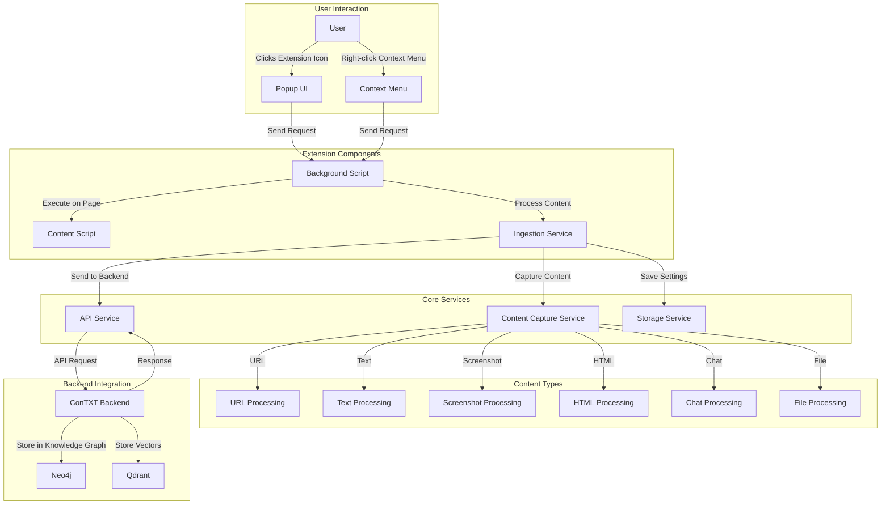

# ConTXT Browser Extension Architecture Diagram

This diagram illustrates the architecture and data flow of the ConTXT Browser Extension, showing how user interactions trigger content capture and processing, which is then sent to the ConTXT backend for integration into the knowledge graph and vector database. 