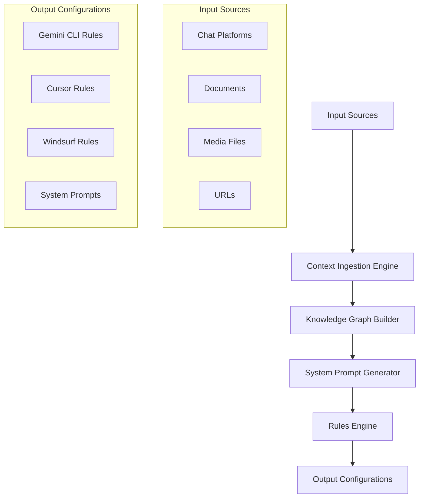

# AI Context Builder

The AI Context Builder is an intelligent platform designed to automatically build comprehensive context for AI applications. It ingests information from multiple sources, generates tailored system prompts, and creates rule configurations for various AI development environments, revolutionizing how developers create and manage context for AI applications.

## Vision

To transform the way developers interact with AI by eliminating the manual effort required to provide context, ensuring every AI interaction is informed, relevant, and optimized for the specific project domain and requirements.

## Core Problem

AI applications often lack proper context, resulting in generic responses and suboptimal performance. Developers spend significant time manually crafting system prompts and rules for different AI tools. This agent solves that by automatically building rich context from diverse sources and generating optimized configurations.

## System Architecture

The system is composed of a frontend and a backend, working together to provide a seamless experience for the user.



## Features

### Multi-Source Context Ingestion

- **Conversation Import:** Import conversation history from various chat platforms like ChatGPT, Claude, Grok, Gemini, Deepseek, and local endpoints.
- **Document Processing:** Process a wide range of document formats including PDF, Images (PNG), JSON, CSV, XML, HTML, and Markdown.
- **URL Processing:** Ingest content from URLs.
- **Google Drive Integration:** Access and process files from Google Drive.
- **Video Information Extraction:** Extract audio from MP4 and MKV files using Whisper, and process YouTube videos.

### Intelligent System Prompt Generation

- **Context Analysis Engine:** Analyzes the ingested data to understand the project domain, user intent, and complexity.
- **Dynamic Prompt Builder:** Generates optimized system prompts based on the analyzed context and user preferences.

### Rules Engine for AI Development Tools

- **Rule Configuration System:** Pre-defined rule templates for various AI tools like Gemini CLI, Cursor, and Windsurf.
- **Dynamic Rule Generation:** Generates specific rules for the target AI tool based on the context.

## Tech Stack

- **Frontend:** Next.js, TypeScript, Tailwind CSS, shadcn/ui
- **Backend:** FastAPI, Python, LangGraph, LangChain, Cognee
- **Databases:** Neo4j, Qdrant, PostgreSQL, Redis
- **Audio Processing:** Whisper
- **Containerization:** Docker

## Project Status

### Phase 1: Core Infrastructure (Hours 1-2)

- [x] Set up LangChain + LangGraph foundation
- [x] Configure Neo4j and Qdrant connections
- [x] Implement basic data ingestion pipeline
- [x] Create simple frontend structure

### Phase 2: Content Processing (Hours 3-4)

- [ ] Implement document processors for all formats
- [ ] Create chat platform importers
- [ ] Build video processing pipeline
- [ ] Set up real-time processing feedback

### Phase 3: Intelligence Layer (Hours 5-6)

- [ ] Develop context analysis engine
- [ ] Implement system prompt generation
- [ ] Create rules engine for different tools
- [ ] Build knowledge graph relationships

### Phase 4: Integration & Polish (Hours 7-8)

- [ ] Connect frontend to backend
- [ ] Implement real-time updates
- [ ] Add error handling and validation
- [ ] Create output file generation

## Getting Started

### Prerequisites

- Docker
- Python 3.10+
- Node.js and pnpm

### Installation

1.  **Clone the repository:**
    ```bash
    git clone <repository-url>
    cd llm-context-builder
    ```

2.  **Backend Setup:**
    - Navigate to the `Backend` directory.
    - Create a virtual environment and install dependencies.
    - Set up your `.env` file.
    - For detailed instructions, see `BACKEND.md`.

3.  **Frontend Setup:**
    - Navigate to the `Frontend` directory.
    - Install dependencies using `pnpm`.
    - For detailed instructions, see `FRONTEND.md`.

### Running the Application

1.  **Start the backend services:**
    ```bash
    docker-compose up -d
    ```
2.  **Start the backend server:**
    - Follow the instructions in `BACKEND.md`.
3.  **Start the frontend server:**
    - Follow the instructions in `FRONTEND.md`.

## Contributing

Contributions are welcome! Please feel free to submit a pull request or open an issue.
